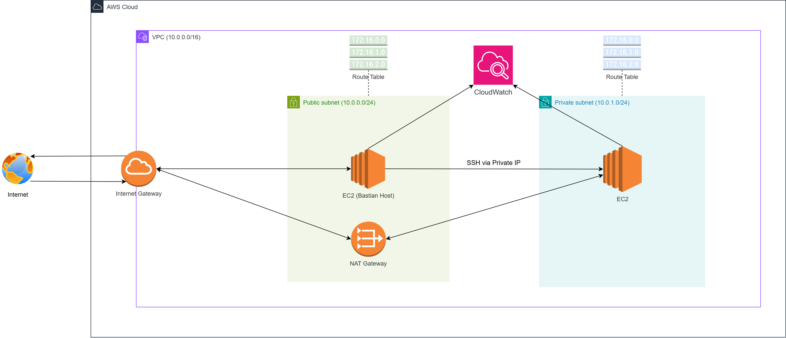
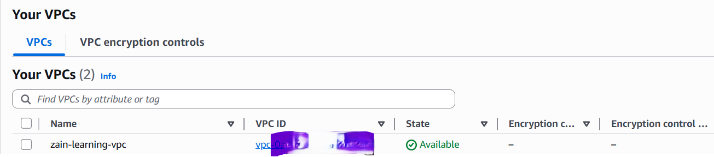
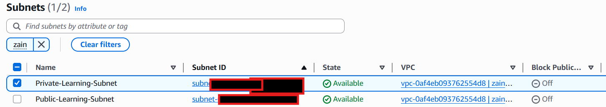
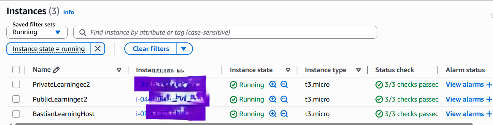

# Assignment 1 – Custom VPC with Public & Private Subnets

## 📌 Overview

This project demonstrates a fully custom Virtual Private Cloud (VPC) built from scratch in AWS, following industry best practices for network segmentation and security.

**Key components:**
- VPC: `10.0.0.0/16`
- Public subnet: `10.0.0.0/24` (with Internet Gateway and auto-assign public IP)
- Private subnet: `10.0.1.0/24` (no direct internet access)
- NAT Gateway (in public subnet) with Elastic IP
- Route tables: public → IGW, private → NAT Gateway
- Bastion host in public subnet
- Private EC2 instance with no public IP
- Security groups: public SG allows SSH only from my home IP; private SG allows SSH only from bastion SG
- CloudWatch monitoring enabled on all instances

## 🏗️ Architecture Diagram

*The diagram shows traffic flow: internet → IGW → bastion → private EC2 for SSH, and private EC2 → NAT → IGW → internet for outbound updates.*

## 📂 Folder Structure

Assignment 1/
├── README.md
├── Assignment 1 Arch.drawio.png
└── Screenshots/
├── vpc-creation.png
├── subnet-settings.png
├── route-tables.png
├── nat-gateway.png
├── ec2-public.png
├── ec2-private.png
├── ssh-bastion.png
├── ssh-private-from-bastion.png
├── curl-ifconfig-private.png
└── cloudwatch-metrics.png

## 🚀 How I Built It (High-Level Steps)

1. **VPC & Subnets** – Created custom VPC `10.0.0.0/16`, public subnet `10.0.0.0/24`, private subnet `10.0.1.0/24`.
2. **Internet Gateway** – Attached to VPC.
3. **NAT Gateway** – Allocated Elastic IP, created NAT Gateway in public subnet.
4. **Route Tables** –  
   - Public route table: `0.0.0.0/0` → IGW, associated with public subnet.  
   - Private route table: `0.0.0.0/0` → NAT Gateway, associated with private subnet.
5. **Security Groups** –  
   - `Public-SG`: inbound SSH from my home IP only.  
   - `Private-SG`: inbound SSH from `Public-SG` only.
6. **EC2 Instances** –  
   - Bastion host in public subnet (auto-assign public IP).  
   - Private EC2 in private subnet (no public IP).
7. **CloudWatch** – Enabled detailed monitoring; installed CloudWatch agent for memory metrics.

## 🧪 Testing & Validation

- ✅ SSH from my local machine into bastion host.
- ✅ From bastion, SSH into private EC2 using its private IP.
- ✅ On private EC2, ran `curl ifconfig.me` – returned the NAT Gateway's Elastic IP, confirming outbound internet via NAT.
- ✅ Verified private EC2 has no public IP and is unreachable from the internet.

## 📸 Screenshots

All step‑by‑step screenshots are in the `Screenshots/` folder. Key ones:

| Step | Screenshot |
|------|-------------|
| VPC created |  |
| Public & private subnets |  |
| Route tables (public → IGW, private → NAT) |  |
| NAT Gateway with Elastic IP |  |
| Bastion & Private host (Private & public EC2) |  |

## 💡 Challenges & Solutions

| Challenge | Solution |
|-----------|----------|
| EC2 instance in public subnet had no public IP | The subnet auto‑assign setting only applies to **new** instances – relaunched the instance. |
| "Managed by AWS" route table couldn't be edited | Created a custom route table for the private subnet and associated it manually. |
| SSH connection timed out | Updated security group rule to my current public IP and checked Network ACL ephemeral ports. |

## 🧠 Lessons Learned

- Draw the architecture **before** building – it reveals dependencies and prevents misconfigurations.
- Subnet settings are **not retroactive**.
- When AWS locks a resource (like a managed route table), build your own instead of trying to unlock it.
- SSH agent forwarding (or copying the key) is necessary for a bastion to reach private instances.

## 🛠️ Technologies Used

- AWS VPC, EC2, IGW, NAT Gateway, Elastic IP, Route Tables, Security Groups, CloudWatch
- Git & GitHub
- draw.io (diagrams)
- SSH (Windows Terminal / PowerShell)
- Amazon Linux 2023 (EC2)
