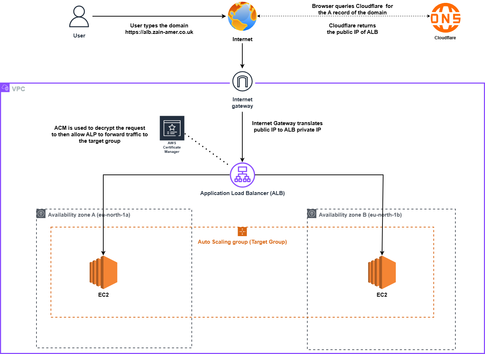
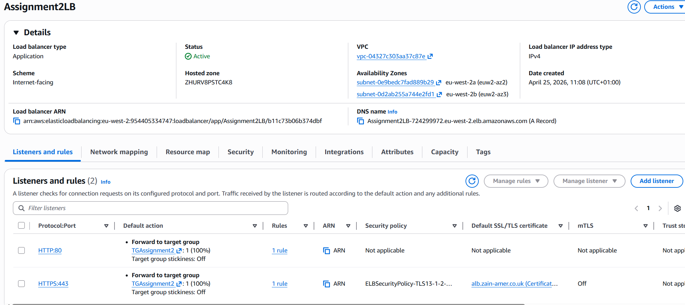
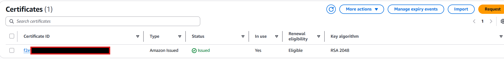
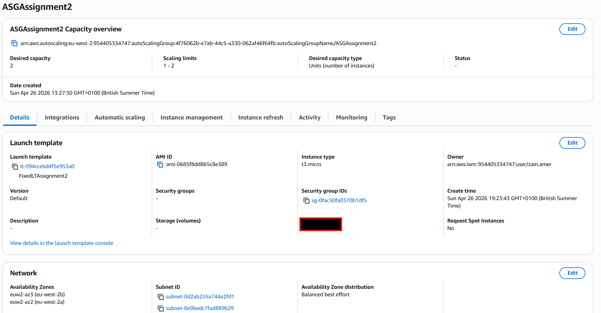

# Assignment 2 – Application Load Balancer with Auto Scaling (Bonus)

## 📌 Overview

This project deploys a highly available, scalable web application on AWS. Two EC2 instances run behind an Application Load Balancer (ALB) that handles all incoming traffic. The instances are not directly accessible from the internet – only the ALB can reach them via security group chaining.

**Bonus features added:**
- Custom domain (`alb.zain-amer.co.uk`) via Route53 alias record
- HTTPS (SSL/TLS) using AWS Certificate Manager (ACM)
- Auto Scaling Group (ASG) to automatically replace unhealthy instances and maintain desired capacity

**Key components:**
- VPC with public subnets (default VPC used)
- Internet Gateway (IGW)
- Application Load Balancer (ALB) in two Availability Zones
- Target group with HTTP health check on `/`
- Security groups:
  - `alb-sg`: inbound HTTP/HTTPS from anywhere
  - `ec2-sg`: inbound HTTP only from `alb-sg` (no direct internet access)
- Two EC2 instances (Amazon Linux 2) with Apache web server installed via user‑data
- Route53 hosted zone (`zain-amer.co.uk`) with A alias record pointing to ALB
- ACM public certificate for `alb.zain-amer.co.uk` attached to ALB's HTTPS listener
- Auto Scaling Group using a launch template, with instance refresh capability

## 🏗️ Architecture Diagram

*The diagram shows traffic flow: user → Route53 → ALB (HTTPS termination) → target group → EC2 instances in two Availability Zones. Security groups (`alb-sg`, `ec2-sg`) enforce isolation. The Auto Scaling Group spans both AZs, and the Internet Gateway enables inbound internet traffic.*

## 🚀 How I Built It (High-Level Steps)

### Core (Tasks 1–4)
1. **EC2 Instances** – launched two Amazon Linux 2 instances in the default VPC, using different Availability Zones (`eu-north-1a`, `eu-north-1b`). User‑data script installed Apache and wrote different HTML messages ("Instance A", "Instance B").
2. **Security Groups** – created:
   - `alb-sg`: inbound HTTP (80) from `0.0.0.0/0`
   - `ec2-sg`: inbound HTTP (80) from `alb-sg` (by security group ID) – no rule from `0.0.0.0/0`
3. **Target Group** – `tg-web`: HTTP on port 80, health check path `/`, healthy threshold 2.
4. **Application Load Balancer** – internet‑facing, listeners on HTTP:80 (later redirect to HTTPS), forward to `tg-web`. Placed in the same two public subnets as the instances.
5. **Testing** – visited ALB DNS name, refreshed to see alternating content; confirmed health checks passed and EC2 instances unreachable directly.

### Bonus (Route53 + ACM + HTTPS)
6. **Route53** – created a public hosted zone for `zain-amer.co.uk`. Added an **A alias record** for `alb.zain-amer.co.uk` pointing to the ALB DNS name.
7. **ACM** – requested a public certificate for `alb.zain-amer.co.uk` using DNS validation. Created the required CNAME record in Cloudflare (DNS still there), waited for `Issued` status.
8. **ALB HTTPS Listener** – added listener on port 443, selected the ACM certificate, and set default action to forward to `tg-web`. Also edited the HTTP:80 listener to **redirect** to HTTPS:443.

### Bonus (Auto Scaling Group)
9. **Launch Template** – created a template using Amazon Linux 2, `t2.micro`, `ec2-sg`, and user‑data script that installs Apache and displays the instance ID (for testing round‑robin).
10. **Auto Scaling Group** – created ASG with desired = 2, minimum = 1, maximum = 2. Attached it to the existing target group (`tg-web`). Set health check type to `ELB` with a grace period of 300 seconds.
11. **Instance Refresh** – updated the launch template with a new user‑data script, then started an instance refresh (minimum healthy percentage 100%) to roll out the change without downtime.

## 🧪 Testing & Validation

- ✅ ALB DNS name returns web page from one of the EC2 instances.
- ✅ Refreshing the page (using `curl` in terminal) alternates between both instances.
- ✅ `https://alb.zain-amer.co.uk` loads with a valid SSL certificate (padlock icon).
- ✅ HTTP requests automatically redirect to HTTPS.
- ✅ Direct access to EC2 public IP (if any) times out – security group blocks it.
- ✅ Target group shows both instances as `healthy`.
- ✅ Auto Scaling Group terminates an unhealthy instance and launches a new one automatically (tested by stopping Apache on one instance).
- ✅ Instance refresh successfully replaced instances with the updated user‑data without downtime.

## 📸 Screenshots

All step‑by‑step screenshots are in the `Screenshots/` folder. Key ones:

| Step | Screenshot |
|------|-------------|
| ALB created with two public subnets |  |
| Target group with healthy instances |  |
| Security group rules (`alb-sg`, `ec2-sg`) |  |
| ACM certificate issued |  |
| Launch template with user-data |  |
| Auto Scaling Group |  |
| Browser showing alternating content  |  |
| Hosted Zone |  |

## 💡 Challenges & Solutions

| Challenge | Solution |
|-----------|----------|
| Instances showed `unhealthy` in target group | The EC2 security group was missing the inbound rule allowing HTTP from the ALB security group. Added it, instances became healthy. |
| Certificate stuck in "Pending validation" | DNS validation CNAME record was not added correctly in Cloudflare. Added the record manually, waited a few minutes, certificate issued. |
| Browser always showed the same instance (no alternation) | The browser was caching the response and reusing the same TCP connection. Used `curl` to confirm round‑robin works; for browser, used private window and disabled cache. |
| Auto Scaling Group kept launching and terminating instances in a loop | The user‑data script had a typo (`httpd` service not started). Fixed the script, updated the launch template, and started an instance refresh. |
| ALB DNS name returned 502 Bad Gateway | No healthy targets. Checked security groups, web server status, and health check path. The health check path needed to be `/` and the web server needed to return a 200 OK. |

## 🧠 Lessons Learned

- **Security group chaining** is a powerful way to isolate resources – the EC2 security group references the ALB security group, not an IP range.
- **Health checks** must match exactly what the web server serves. A simple `curl http://localhost` on the instance is the fastest debug.
- **ACM DNS validation** requires the CNAME record to be publicly resolvable. If using external DNS (Cloudflare), add it manually and verify with `nslookup`.
- **Auto Scaling Group instance refresh** is a safe way to deploy changes. Setting `MinimumHealthyPercentage` to 100 ensures zero downtime, but it takes longer.
- **Browser behaviour** (persistent connections, caching) can hide round‑robin load balancing. Always test with `curl` or in private windows.
- **User‑data scripts** should be tested on a single instance before baking into a launch template. The system log (`/var/log/cloud-init-output.log`) is invaluable.

## 🛠️ Technologies Used

- AWS EC2, VPC, Application Load Balancer, Target Groups, Security Groups, Route53, Certificate Manager (ACM), Auto Scaling Groups, Launch Templates
- Amazon Linux 2 (Apache)
- Git & GitHub
- draw.io (architecture diagram)
- SSH (Windows Terminal / PowerShell)
- `curl`, `nslookup`, `scp`
- Cloudflare (DNS during transition, later replaced by Route53)