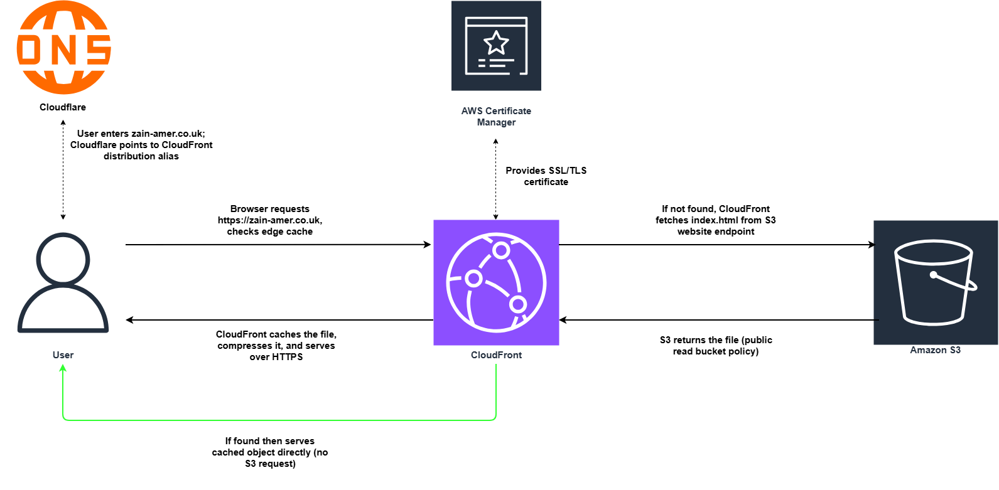
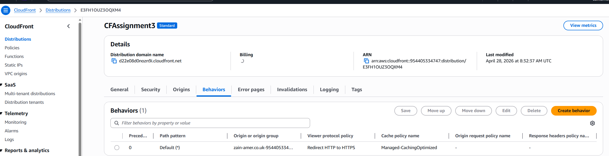
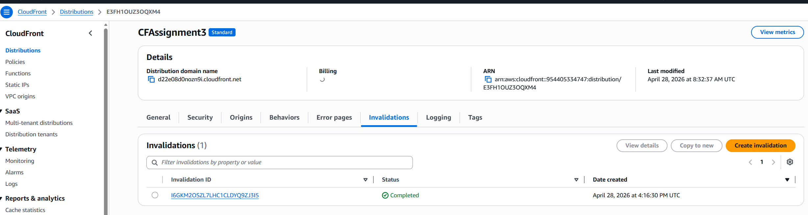

# Assignment 3 – S3 Static Website + CloudFront CDN + Custom Domain (Cloudflare DNS)

## 📌 Overview

This project demonstrates a production-ready static website hosted on Amazon S3, delivered globally via CloudFront CDN with HTTPS, and accessible via a custom domain (`zain-amer.co.uk`) using **Cloudflare** as the DNS provider. 

**Key components:**
- S3 bucket with static website hosting enabled
- `index.html` and `error.html` uploaded
- Bucket policy making objects publicly readable (required for the assignment)
- CloudFront distribution with:
  - Origin = S3 website endpoint
  - HTTPS (redirect HTTP → HTTPS)
  - Compression enabled 
  - Managed cache policy: `CachingOptimized`
  - Allowed HTTP methods: GET, HEAD
- Cloudflare DNS: CNAME record pointing 'zain-amer.co.uk' to CloudFront distribution domain
- ACM certificate (us-east-1) attached to CloudFront for custom domain HTTPS
- Cache invalidation demonstrated (updating content and forcing refresh)

> **Note:** The Route53 (hosted zone, alias record) was attempted but the domain transfer from Cloudflare to Route53 failed (free tier / registrar lock).

## 🏗️ Architecture Diagram

*The diagram shows traffic flow: User → Cloudflare DNS (CNAME) → CloudFront (HTTPS, caching, compression) → S3 (origin). On cache hit, CloudFront serves directly; on cache miss, it fetches from S3. ACM provides TLS certificate attached to CloudFront.*

## 🚀 How I Built It (High-Level Steps)

1. **S3 Bucket & Hosting**  
   - Created bucket (name matches domain e.g., `zain-amer.co.uk`).  
   - Enabled static website hosting, set index/error documents.  
   - Uploaded `index.html` and `error.html`.  
   - Applied bucket policy for public read access.

2. **CloudFront Distribution**  
   - Origin = S3 **website endpoint** (e.g., `bucket.s3-website.eu-north-1.amazonaws.com`).  
   - Viewer protocol policy: `Redirect HTTP to HTTPS`.  
   - Compress objects: `Yes`.  
   - Cache policy: `CachingOptimized` (managed).  
   - Allowed methods: `GET, HEAD`.  
   - Added alternate domain name (CNAME) and attached ACM certificate (us-east-1).

3. **ACM Certificate (for Custom Domain HTTPS)**  
   - Requested public certificate in `us-east-1` for `zain-amer.co.uk`.  
   - Validated via DNS (CNAME record added to Cloudflare DNS – see step 4).  
   - Status became `Issued`, then attached to CloudFront.

4. **Cloudflare DNS (Custom Domain)**  
   - In Cloudflare dashboard, added a **CNAME record**:  
     - Name: `@` (root domain)  
     - Target: CloudFront distribution domain 
     - Proxy status: **DNS only** (grey cloud) – to avoid SSL conflicts.  
   - Waited for DNS propagation (~5–10 minutes).

5. **Testing & Cache Invalidation**  
   - Verified S3 website endpoint and CloudFront domain serve correct content.  
   - Modified `index.html` in S3.  
   - Observed CloudFront still serving old cached version.  
   - Created CloudFront invalidation (`/index.html` or `/*`).  
   - Refreshed – new content appeared, `x-cache: Hit from cloudfront` appeared on subsequent requests.

## 🧪 Testing & Validation

- ✅ S3 static website endpoint returns `index.html` with correct title and heading.
- ✅ CloudFront default domain returns same content over HTTPS.
- ✅ Custom domain `https://zain-amer.co.uk` resolves to CloudFront and shows padlock (HTTPS).
- ✅ After updating `index.html`, cache invalidation forces fresh content.
- ✅ ACM certificate status is `Issued` and correctly attached to distribution.

## 📸 Screenshots

All step‑by‑step screenshots are in the `Screenshots/` folder. Key ones:

| Step | Screenshot |
|------|-------------|
| S3 bucket created |  |
| Bucket policy (public read) |  |
| CloudFront distribution created |  |
| ACM certificate (us-east-1) |  |
| CloudFront domain working |  |
| Cache invalidation created |  |

## 💡 Challenges & Solutions

| Challenge | Solution |
|-----------|----------|
| S3 bucket policy gave `Action does not apply to any resource(s)` | The `Resource` ARN must end with `/*` and exactly match the bucket name. |
| CloudFront returned `Access Denied` | Origin was REST endpoint instead of website endpoint; fixed by changing to `s3-website-...` URL and setting origin access to `Public`. |
| Updated `index.html` but CloudFront still showed old content | CloudFront caches by default (TTL up to 24h). Created manual invalidation to force refresh. |
| Browser didn't show new `<title>` | Hard refresh (Ctrl+Shift+R) or incognito window – browser cache was the issue. |
| ACM certificate couldn't be attached to CloudFront | Certificate must be requested in `us-east-1` region – recreated it there. |
| Domain transfer from Cloudflare to Route53 failed | Used free tier account without domain registration.|

## 🧠 Lessons Learned

- The S3 **website endpoint** (`s3-website-...`) is required for CloudFront to serve index documents automatically – the REST endpoint does not support that.
- `CachingOptimized` policy is great for performance but means updates require explicit invalidation.
- ACM certificates for CloudFront **must** be in `us-east-1` – common pitfall.
- Always test with `curl -I` and check `x-cache` headers to verify CDN behaviour.

## 🛠️ Technologies Used

- AWS S3 (static website hosting)
- AWS CloudFront (CDN, HTTPS, caching, compression, invalidation)
- AWS Certificate Manager (ACM, TLS certs – bonus)
- AWS CLI (upload files, testing, invalidation)
- Cloudflare (DNS - CNAME record to CloudFront)
- Git & GitHub
- draw.io (diagrams)
