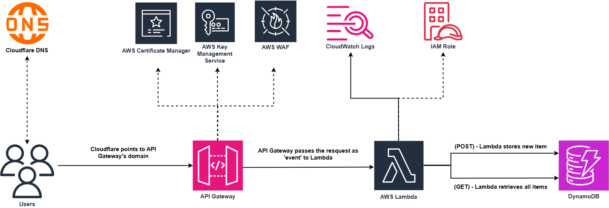
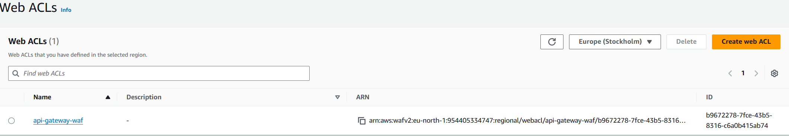

# Assignment 4 – Serverless API with Lambda, IAM, and API Gateway 

## 📌 Overview

This project builds a fully serverless REST API using AWS API Gateway, Lambda, and DynamoDB. It follows the principle of least‑privilege IAM and includes production‑ready features like API keys, usage plans, WAF rate limiting, and a custom domain with ACM.

**Key components:**
- **DynamoDB** – `students` table (on‑demand capacity, partition key `id`).
- **Lambda (Python)** – `students-api-handler` with logic for `POST /submit` (store data) and `GET /` (scan table).
- **API Gateway (REST)** – `/submit` (POST) and `/` (GET) methods with **Lambda proxy integration**, CORS enabled, deployed to `prod` stage.
- **IAM Role** – Least‑privilege execution role allowing only `dynamodb:PutItem`, `dynamodb:Scan`, and basic CloudWatch logs.
- **CloudWatch Logs** – Captures all Lambda invocations and `print()` outputs.
- **API Keys + Usage Plan** – Throttling (5 req/sec, burst 10) and quota (1000 req/day) enforced via `x-api-key` header.
- **AWS WAF** – Web ACL with a rate‑based rule (2000 requests per 5 minutes per IP) attached to the API stage.
- **ACM + Custom Domain** – SSL/TLS certificate for `api.zain-amer.co.uk` associated with a regional API Gateway custom domain. Cloudflare DNS points the subdomain to the API Gateway target domain.

## 🏗️ Architecture Diagram

*The diagram shows a client request flowing through Cloudflare DNS (optional custom domain) → WAF → API Gateway (with API key validation and usage plan throttling) → Lambda → DynamoDB. IAM role attaches to Lambda, and Lambda sends logs to CloudWatch. ACM provides the certificate for the custom domain.*

## 🚀 How I Built It (High-Level Steps)

1. **DynamoDB** – Created `students` table with partition key `id` (String), on‑demand capacity.
2. **IAM Role** – Created `lambda-students-role` with custom inline policy: `dynamodb:PutItem`, `dynamodb:Scan`, and CloudWatch logs actions. No wildcards.
3. **Lambda Function** – Wrote Python code with AI assistance that:
   - Detects HTTP method (`POST` or `GET`) from the event.
   - On `POST`: parses JSON body, generates UUID and timestamp, stores `{id, timestamp, payload}` in DynamoDB.
   - On `GET`: scans the table and returns all items.
   - Returns appropriate HTTP status codes (200, 400, 500, 405) with JSON bodies.
4. **API Gateway** – Created REST API `students-api`:
   - `POST /submit` with Lambda proxy integration, CORS enabled.
   - `GET /` (root) with Lambda proxy integration.
   - Deployed to `prod` stage.
5. **API Keys + Usage Plan** – Generated an API key, created a usage plan with rate 5/sec, burst 10, quota 1000/day, associated with the key and the `prod` stage. Marked both methods as “API Key Required”.
6. **AWS WAF** – Created a Web ACL with a rate‑based rule (2000 requests/5 minutes per IP), attached to the API Gateway `prod` stage.
7. **Custom Domain + ACM** – Requested a public certificate in ACM (`eu-north-1`) for `api.zain-amer.co.uk`, validated via DNS (CNAME). Created API Gateway custom domain name, associated the certificate, and mapped it to the `students-api` and `prod` stage. Added a CNAME record in Cloudflare pointing `api.zain-amer.co.uk` to the API Gateway target domain (e.g., `d-xxxxxxxxxx.execute-api.eu-north-1.amazonaws.com`). Disabled Cloudflare proxy (grey cloud) to avoid SSL interference.

## 🧪 Testing & Validation

- ✅ `POST /submit` with valid JSON → returns `200` with `id` and `timestamp`; item appears in DynamoDB.
- ✅ `POST /submit` with invalid JSON → returns `400` with error message.
- ✅ `GET /` → returns JSON array of all stored items (empty `[]` if none).
- ✅ Request without `x-api-key` header → returns `403 Forbidden`.
- ✅ Sending requests faster than the usage plan limits → receives `429 Too Many Requests`.
- ✅ Sending high volume from one IP → WAF rate limit returns `403 Forbidden`.
- ✅ Custom domain `https://api.zain-amer.co.uk` works with correct SSL certificate and returns same responses as the default API Gateway URL.
- ✅ CloudWatch Logs contain `print()` output and invocation reports for debugging.

## 📸 Screenshots

All screenshots are in the `Screenshots/` folder. Key ones:

| Step | Screenshot |
|------|-------------|
| DynamoDB table created |  |
| Lambda code & configuration |    
| IAM role with least‑privilege policy |  |
| API Gateway resources (POST /submit, GET /) |  |
| `curl POST` successful response |  |
| API key + usage plan configuration |  |
| WAF Web ACL with rate rule test |  |
| `curl` to custom domain |  |

## 💡 Challenges & Solutions

| Challenge | Solution |
|-----------|----------|
| Lambda kept returning `502 Internal Server Error` on `GET` requests. | The original code only handled `POST`. Added conditional branching on `event['httpMethod']` and implemented `Scan` logic. |
| IAM policy missing `dynamodb:Scan`, causing `AccessDeniedException`. | Updated the inline policy to include `Scan` alongside `PutItem`. |
| API Gateway returned `{"message": "Missing Authentication Token"}` for `GET /`. | The `GET` method was not created on the root resource. Created it with Lambda proxy integration and redeployed. |

## 🧠 Lessons Learned

- **Least‑privilege IAM** is straightforward: only grant the exact actions needed (`PutItem`, `Scan`) on the specific resource (the `students` table). Avoid managed policies like `DynamoDBFullAccess`.
- **Lambda proxy integration** gives full control over the HTTP response, but requires the Lambda to return a correctly formatted `{statusCode, headers, body}` object.
- **Error handling** in Lambda must catch `KeyError`, `JSONDecodeError`, and `TypeError` (when `event['body']` is `None`).
- **API Gateway custom domains** require the ACM certificate to be in the **same region** for regional endpoints, and the CNAME must point to the **target domain name** shown in the custom domain settings, not the default API endpoint.
- **Cloudflare proxy** can interfere with API Gateway’s SSL handshake; for APIs, it’s often easier to set the CNAME to “DNS only” (grey cloud).
- **Testing incrementally** – first test the Lambda with a mock event, then test API Gateway without API keys, then add keys and WAF one at a time. This isolates failures.

## 🛠️ Technologies Used

- **AWS** – DynamoDB, Lambda, API Gateway, IAM, CloudWatch, ACM, WAF
- **Python 3.9+** – Lambda runtime
- **curl** – API testing
- **Cloudflare** – DNS management for custom domain
- **draw.io** – Architecture diagram
